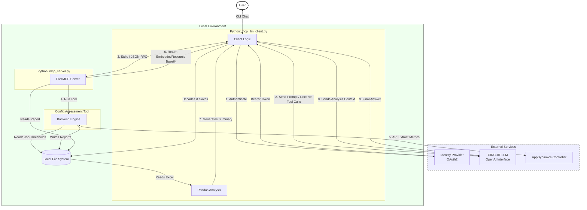

# High Level Architecture: MCP Client & Server Integration

This diagram illustrates how the `mcp_llm_client.py` acts as a bridge between the **User**, the internal **CIRCUIT AI**, and your local **Assessment Engine**.

## Key Components

1.  **MCP Client (`mcp_llm_client.py`)**:
    *   The "Brain" of the operation locally.
    *   Authenticates with your internal IdP.
    *   Maintains the conversation history with CIRCUIT.
    *   Interprets tool calls from CIRCUIT and executes them on the local server via Stdio.
    *   **Crucial Step**: Intercepts the binary Excel response, saves it to disk, uses `pandas` to read it, and feeds a text summary back to the LLM so it can "see" the data.

2.  **MCP Server (`mcp_server.py`)**:
    *   The "Hands" of the operation.
    *   Run as a subprocess by the client.
    *   Exposes `run_assessment` and `list_jobs` as callable tools.
    *   Wraps the legacy `Engine` code.
    *   Encodes the resulting Excel report into a Base64 `EmbeddedResource` compliant with MCP.

3.  **CIRCUIT / LLM**:
    *   The "Intelligence".
    *   Doesn't run code itself; it just predicts which tool to call and interprets the text summaries provided by the client.

4.  **Local File System**:
    *   Acts as the persistent storage for the inputs (Jobs) and outputs (Reports), bridging the Engine's file-based operations with the Client's analysis logic.

