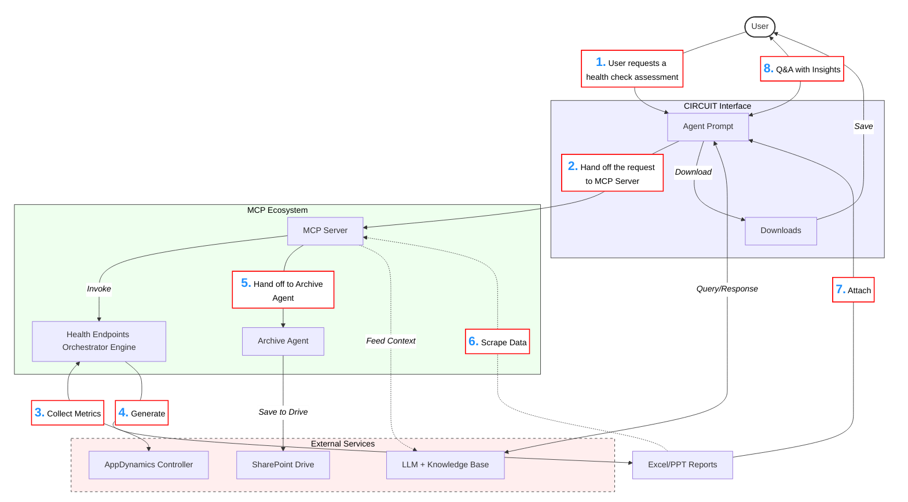

# Architecture: Advanced Health Check & LLM Insight Flow

This diagram illustrates the advanced workflow including LLM integration for conversational insights and aggregate knowledge usage.

```mermaid
flowchart TD
    %% Main Layout: User -> Interface -> MCP (Left-to-Right)
    subgraph TopRow [ ]
        direction LR
        style TopRow fill:transparent,stroke:none
        
        User([User])

        subgraph Interface [CIRCUIT Interface]
            direction TB
            Prompt[Agent Prompt]
            Downloads[Downloads]
        end

        subgraph MCP [MCP Ecosystem]
            direction TB
            Server[MCP Server]
            Engine[Health Endpoints Orchestrator Engine]
            Archiver[Archive Agent]
        end
    end

    %% External Services at the bottom
    subgraph External [External Services]
        direction LR
        AppD[AppDynamics Controller]
        LLM[LLM + Knowledge Base]
        SharePoint[SharePoint Drive]
    end
    
    Reports[Excel/PPT Reports]

    %% -------------------
    %% Flow Definitions
    %% -------------------

    %% 1. Request
    User -->|<div style='border:2px solid red; padding:5px; background:white; display:inline-block; color:black'><span style='color:DodgerBlue; font-size:24px; font-weight:bold'>1.</span> User requests a health check assessment</div>| Prompt
    
    %% 2. Execution Chain
    Prompt -->|<div style='border:2px solid red; padding:5px; background:white; display:inline-block; color:black'><span style='color:DodgerBlue; font-size:24px; font-weight:bold'>2.</span> Hand off the request to MCP Server</div>| Server
    Server -->|<div style='background:white; padding:2px; font-style:italic; color:black'>Invoke</div>| Engine
    
    %% 3. Metrics Collection (Engine -> External)
    Engine <-->|<div style='border:2px solid red; padding:5px; background:white; display:inline-block; color:black'><span style='color:DodgerBlue; font-size:24px; font-weight:bold'>3.</span> Collect Metrics</div>| AppD
    
    %% 4. Report Generation
    Engine -->|<div style='border:2px solid red; padding:5px; background:white; display:inline-block; color:black'><span style='color:DodgerBlue; font-size:24px; font-weight:bold'>4.</span> Generate</div>| Reports
    
    %% 5. Archive to SharePoint
    Server -->|<div style='border:2px solid red; padding:5px; background:white; display:inline-block; color:black'><span style='color:DodgerBlue; font-size:24px; font-weight:bold'>5.</span> Hand off to Archive Agent</div>| Archiver
    Archiver -->|<div style='background:white; padding:2px; font-style:italic; color:black'>Save to Drive</div>| SharePoint

    %% 6. Feedback Loop
    Reports -.->|<div style='border:2px solid red; padding:5px; background:white; display:inline-block; color:black'><span style='color:DodgerBlue; font-size:24px; font-weight:bold'>6.</span> Scrape Data</div>| Server
    Server -.->|<div style='background:white; padding:2px; font-style:italic; color:black'>Feed Context</div>| LLM
    
    %% 7. Delivery
    Reports -->|<div style='border:2px solid red; padding:5px; background:white; display:inline-block; color:black'><span style='color:DodgerBlue; font-size:24px; font-weight:bold'>7.</span> Attach</div>| Prompt
    Prompt -->|<div style='background:white; padding:2px; font-style:italic; color:black'>Download</div>| Downloads
    Downloads -->|<div style='background:white; padding:2px; font-style:italic; color:black'>Save</div>| User

    %% 8. Insights (User -> Prompt -> LLM)
    User <-->|<div style='border:2px solid red; padding:5px; background:white; display:inline-block; color:black'><span style='color:DodgerBlue; font-size:24px; font-weight:bold'>8.</span> Q&A with Insights</div>| Prompt
    Prompt <-->|<div style='background:white; padding:2px; font-style:italic; color:black'>Query/Response</div>| LLM

    %% Styling
    style User fill:#fff,stroke:#333,stroke-width:2px
    style Interface fill:#eef,stroke:#333,color:#000
    style MCP fill:#efe,stroke:#333,color:#000
    style External fill:#fee,stroke:#333,stroke-dasharray: 5 5,color:#000
```
