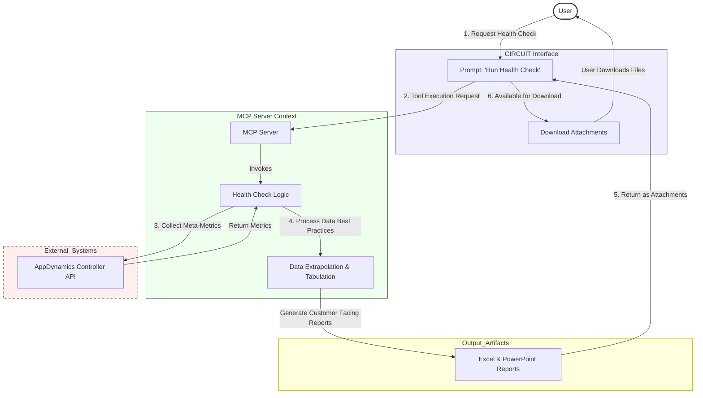

# Architecture: Health Check Job Execution Flow

This diagram illustrates the process of running a health check job via CIRCUIT and the MCP Server, focusing on the data flow and report generation.

