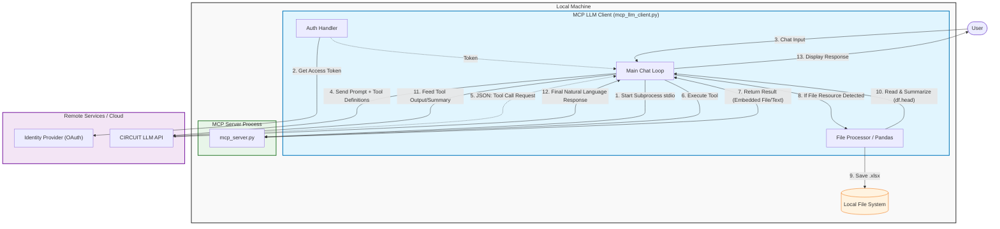

# Architecture: MCP LLM Client Integration Flow

This diagram illustrates the internal architecture and flow of the `mcp_llm_client.py` application, highlighting how it orchestrates interactions between the User, the Local MCP Server, and the remote CIRCUIT LLM service.

